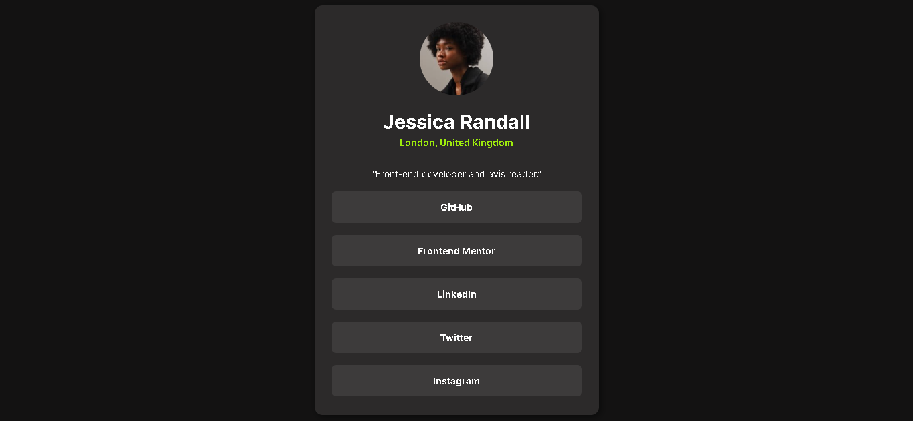

# 🌐 Simple Portfolio (HTML & CSS)

> ⚠️ This is a **practice project** to improve my HTML and CSS skills.  
> The layout is **based on an existing design** and is **not my original creation**.

---

## 📁 Technologies Used

- **HTML5**
- **CSS3**

---

## 🧠 What I Practiced

- Semantic HTML structure
- CSS styling and layout techniques
- Project folder organization (images, fonts, etc.)
- (Optional) Responsive design basics

---

## 🖼️ Preview

---

## 🎓 Credits

This design is based on the work of **[Author Name]**.  
Original project/tutorial: [link if available]

---

## 🚀 How to Run

Just open the `index.html` file in your browser.

---

## 📌 Disclaimer

This project is for **educational purposes only**.  
All rights to the original design belong to the respective author.

---
